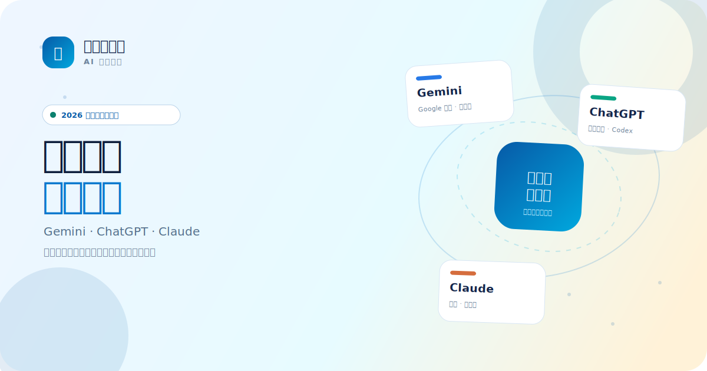
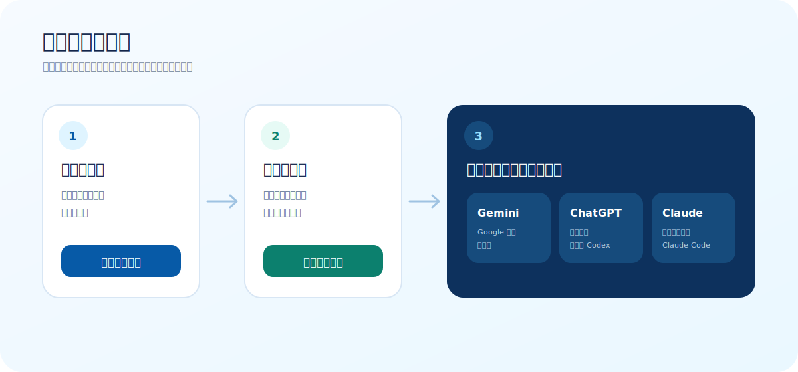

<div align="center">
  
</div>

# 2026 国内 AI 订阅充值指南：Gemini、ChatGPT、Claude 代充与成品账号怎么选？

> 最近更新：2026 年 7 月 18 日<br>
> 本文由 **彼岸花网络**维护，购买链接会指向自营商城。本文不是 Google、OpenAI 或 Anthropic 的官方页面，彼岸花网络与这些公司无隶属或官方合作关系。

国内用户购买 Gemini、ChatGPT、Claude 订阅时，真正难的通常不是“找到一个付款按钮”，而是先弄清楚自己买到的究竟是什么：是给现有账号开通会员、交付一个成品账号、提供 CDK 或激活链接，还是只保障某项功能可以使用。

这篇指南不把几十件商品一股脑堆给你。它只做三件事：

1. 帮你判断更适合 Gemini、ChatGPT 还是 Claude；
2. 帮你分清代充值、成品账号、CDK/激活链接的区别；
3. 在进入商城前，把交付内容、首登要求和售后边界讲清楚。

<div align="center">

**🌐 在线站点（GitHub Pages）：[ai-opay.github.io](https://ai-opay.github.io/)**

[打开购买前选择器](https://ai-opay.github.io/#selector) · [查看实时商城](https://shop.rtxk.us) · [联系客服](https://t.me/geek_out_net)

</div>

---

## 一分钟选择：先看账号状态，再看使用场景

如果你只想快速得到一个方向，先看下面这张表。

| 你的情况 | 建议先看 | 为什么 |
| --- | --- | --- |
| 已经有长期使用的个人账号 | 代充值 | 可以保留原账号中的对话、项目和设置 |
| 没有合适账号，或不想处理注册 | 成品账号 | 减少准备步骤，但要认真核对首登和接管资料 |
| 希望自己完成激活 | CDK / 激活链接 | 操作更自主，但要确认账号条件、有效期和兑换要求 |
| 依赖 Google 生态和多模态 | Gemini | 更适合 Google 相关工作流和长周期方案比较 |
| 需要通用工作、图像、数据分析 | ChatGPT | 工具覆盖面广，也可以进一步比较 Codex 相关账号 |
| 主要写代码、处理长文本、使用 Claude Code | Claude | 更适合代码、长上下文和复杂工作流 |

还是拿不准？仓库内置了一个不收集账号信息的 **30 秒选择器**：只回答主要使用场景和是否已有账号，就会给出产品与交付方式建议。

<div align="center">
  
</div>

---

## 三种交付方式：名字相似，买到的东西不同

### 1. 给自己的账号代充值

适合已经有稳定账号，并希望保留历史记录、项目、个性化设置的人。你购买的是“为现有账号开通某种订阅”的服务，而不是另一个账号。

购买前重点确认：

- 对应的具体档位，例如 Plus、Pro、Max 5x 或 Max 20x；
- 需要提供或配合哪些步骤；
- 预计处理时间和完成后的验证方式；
- 售后保障的是成功开通、掉订阅，还是指定周期；
- 哪些账号状态、地区或环境问题不在售后范围内。

已有账号并不意味着任何商品都能直接使用。账号历史订阅、活动资格和平台规则都可能影响具体流程，因此要以商品详情为准。

### 2. 购买成品账号

适合没有合适账号、注册受阻，或者希望减少准备步骤的人。你购买的是一套账号交付资料，商品可能同时包含订阅，也可能只解决账号或验证问题。

购买前重点确认：

- 是否已经包含会员，以及会员档位和剩余周期；
- 会交付账号、密码、辅助邮箱、2FA 或哪些验证信息；
- 是否要求在指定时间内完成首次登录；
- 拿到后哪些资料可以修改，应该按什么顺序操作；
- 售后只保障首登，还是也处理掉订阅和账号异常。

成品账号尤其不能只看价格。明显便宜的账号商品，可能与完整周期代充值在交付内容、订阅状态和售后范围上完全不同。

### 3. CDK、兑换码或激活链接

这类商品通常需要你按照说明在自己的账号上完成操作。优点是步骤更自主，缺点是账号条件、兑换资格和有效时间往往更具体。

购买前重点确认：

- 适用哪种账号和地区；
- 是否覆盖已有订阅或活动资格；
- 兑换码或链接多久有效；
- 是否要求绑定支付方式或完成额外验证；
- 售后以“成功兑换”为止，还是包含后续订阅状态。

---

## Gemini：适合 Google 生态、多模态和长周期方案

Gemini 相关商品的选择最多，既有 12 个月、18 个月等长周期方案，也有 CDK、激活链接和成品账号。看起来选择很多，但真正需要先分清的是“给自己的 Google 账号开通权益”还是“购买另一套账号”。

### 什么人更适合 Gemini？

- 经常使用 Google 生态产品；
- 重视文本、图片等多模态处理；
- 希望比较较长周期的订阅方案；
- 已经有合适 Google 账号，想继续使用原账号；
- 或者没有合适账号，需要成品账号作为起点。

### Gemini 购买前最容易忽略什么？

第一，Gemini 网页端可用不等于所有 Google 服务都在保障范围内。Gmail、GCP、Flow、第三方授权等能力是否包含，要看商品详情明确写了什么。

第二，长期账号中可能包含邮件和个人资料。购买代充值或激活商品之前，应先完善恢复邮箱和两步验证；购买成品账号时，不建议把唯一副本的重要资料长期只放在该账号中。

第三，不要把不同商品的首登和改密经验互相套用。成品账号的来源、状态和售后规则不同，应按购买的具体商品说明操作。

更完整的账号条件、成品账号核对项和常见问题，可查看仓库中的 [Gemini 专题攻略](https://ai-opay.github.io/guides/gemini.html)。

[查看 Gemini 实时商品](https://shop.rtxk.us) · [Gemini 专题攻略](https://ai-opay.github.io/guides/gemini.html)

---

## ChatGPT：适合通用工作、图像、数据分析和 Codex

ChatGPT 商品容易混淆的地方，是 Plus/Pro 订阅和成品账号经常出现在同一个列表里。一个十几元的成品账号，与给个人账号开通完整订阅并不是同一种交付，不能只比较数字。

### 什么人更适合 ChatGPT？

- 需要覆盖面较广的日常 AI 工具；
- 经常处理文档、图像、数据分析或通用写作；
- 希望使用 Codex 等编程能力；
- 已有长期账号，希望保留项目和历史对话；
- 或者希望购买已经完成特定验证的账号。

### Plus、Pro、成品账号怎么判断？

日常对话、文件、图像和一般生产力，可以先比较 Plus；确实有持续高用量需求时再看 Pro。档位更高不自动等于更适合，预算和实际工作量才是判断依据。

如果主要为了 Codex，要确认商品写明的验证状态、订阅档位和功能范围。“已接码”“网页”“反代”“非日抛”等词都代表交付差异，遇到不理解的词，应在下单前确认，而不是根据标题自行推断。

购买成品账号时，至少核对四项：是否含会员、是否已接码、首登保障多久、能否完整获得邮箱和验证资料。购买账号内充值时，则重点核对档位、渠道、到账和掉订阅售后。

更完整的 Plus/Pro 对比、Codex 说明和账号接管核对项，可查看 [ChatGPT 专题攻略](https://ai-opay.github.io/guides/chatgpt.html)。

[查看 ChatGPT 实时商品](https://shop.rtxk.us) · [ChatGPT 专题攻略](https://ai-opay.github.io/guides/chatgpt.html)

---

## Claude：适合代码、长文本和 Claude Code 工作流

Claude 常被用于代码、长文档、复杂推理和 Claude Code。选择 Claude 时，先按真实使用强度判断 Pro、Max 5x 或 Max 20x，再决定为自己的账号充值，还是购买独享成品账号。

### 什么人更适合 Claude？

- 日常处理代码、项目上下文和长文档；
- 使用 Claude Code 完成真实开发工作；
- 重视长文本理解和复杂推理；
- 已经有保存项目和对话的 Claude 账号；
- 或者注册受阻，需要交付完整资料的独享账号。

### Pro 和 Max 应该怎么选？

普通个人写作、代码和长文档，可以先从 Pro 的使用量判断。更频繁的代理任务、持续较重的 Claude Code 工作流，再比较 Max 5x。只有持续高强度开发、复杂任务和较高的中断成本，才有必要认真比较 Max 20x。

不要仅因为“更高档”就购买超出实际需要的用量。先估算每天使用时长、项目规模、并行任务和额度中断对工作的影响，通常比看营销标题更可靠。

购买成品账号时，要确认订阅档位、剩余周期、交付资料、首登环境和掉订阅售后；给自己的账号充值时，要确认账号状态、开通流程和完成后的验证方式。

无论使用哪种在线 AI，都不应把唯一代码副本、密钥或敏感资料只保存在对话上下文中。重要项目继续使用自己的版本控制、备份和权限系统。

更完整的 Pro/Max 对比、Claude Code 场景和成品账号核对项，可查看 [Claude 专题攻略](https://ai-opay.github.io/guides/claude.html)。

[查看 Claude 实时商品](https://shop.rtxk.us) · [Claude 专题攻略](https://ai-opay.github.io/guides/claude.html)

---

## 更具体的购买决策案例

下面这些案例不是用户评价，也不是对某一商品的保证，而是把前面的选择逻辑放进更具体的使用情境。你可以只展开与自己接近的一项，不需要从头读到尾。

<details>
<summary><strong>案例一：已经有主力账号，最担心历史数据丢失</strong></summary>

这类用户应先排除成品账号路线，因为成品账号会交付另一套资料，无法自动继承原账号中的对话、项目和设置。更合适的起点是账号内代充值、CDK 或激活链接。选择时不要先问“哪件最便宜”，而要先问自己的账号是否满足地区、历史订阅和活动资格，商品需要提供哪些配合，完成后在哪里检查权益，以及售后保障的是成功开通还是指定周期。

如果账号里保存着邮件、代码、合同或其他重要内容，购买前先完成恢复方式和备份。任何在线订阅都不应承担唯一存储的角色。充值完成后先核对订阅状态和到期时间，再按商品说明处理后续安全设置，不要为了赶时间把密码、验证码和恢复密钥发送到与订单无关的页面。

</details>

<details>
<summary><strong>案例二：没有合适账号，希望拿到后尽快开始使用</strong></summary>

这类用户可以了解成品账号，但要把“可以登录”“包含会员”“可以长期接管”视为三个不同问题。商品可能只保障首次登录，也可能包含指定周期订阅；有些会交付辅助邮箱或 2FA，有些只交付基本登录资料。购买前应确认全部交付字段、首次验证时限、订阅档位、剩余周期和可以修改的信息。

拿到账号后，先在商品规定的时间内完成验货并保留订单记录。不要同时在多台设备、多个地区反复尝试，也不要在没有理解说明时连续修改多项敏感设置。确认接管能力之前，不要将工作文件、私人邮件或唯一恢复方式长期放进账号。成品账号减少的是注册准备步骤，不代表平台规则和登录环境可以忽略。

</details>

<details>
<summary><strong>案例三：预算有限，看到明显低价的 Plus 或成品号</strong></summary>

先比较交付内容，而不是把所有标题里带 Plus 的商品放在同一价格轴上。低价商品可能交付账号但不包含完整周期会员，也可能只保障首登，或者对 Codex、网页、反代等能力有不同限制。完整周期代充值则通常解决另一类需求：给现有账号开通订阅，并按商品约定处理掉订阅问题。

判断低价商品是否适合自己，可以依次问：是否含订阅、订阅剩余多久、账号由什么邮箱注册、是否完成需要的验证、能否获得恢复资料、首登多久内必须完成、售后覆盖哪些异常。只要其中一项说不清楚，就先咨询，不要用自己的想象补齐商品说明。

</details>

<details>
<summary><strong>案例四：为了编程，在 ChatGPT 和 Claude 之间犹豫</strong></summary>

不要只比较模型排行榜，先看自己的工作流。需要通用问答、图像、数据分析并兼顾 Codex，可以从 ChatGPT 路线开始；更重视大型代码上下文、长文档和 Claude Code，可以从 Claude 路线开始。两者都可能适合开发者，但工具是否真正节省时间，取决于项目类型、使用习惯和中断成本。

如果只是偶尔写小脚本，没有必要同时购买多个高档订阅。可以先选择一个产品和较低档位，记录一周内的使用时长、额度中断和真正完成的任务，再决定是否升级或增加第二种工具。重要代码继续保存在自己的 Git 仓库，密钥和生产配置放在受控系统，不要把聊天上下文当作版本控制和备份。

</details>

<details>
<summary><strong>案例五：看中 Gemini 一年以上的长周期方案</strong></summary>

长周期方案不能只用总价除以月份。先确认权益从什么时候开始、适用什么账号、兑换或激活是否有时间限制、是否要求特定地区或绑定方式，以及商品保障的是 Gemini 网页端还是还包含其他 Google 服务。名称中出现 Google 生态，并不自动表示 Gmail、GCP、Flow 或第三方授权都在服务范围内。

如果你还没有稳定使用 Gemini 的习惯，可以先验证主要场景，再决定长期投入。已经有常用 Google 账号的人，还要考虑账号中邮件、文件和恢复方式的重要性；购买成品账号的人，则要确认长期接管资料和首登规则。周期越长，越应该把交付和售后边界读完整，而不是因为月均数字看起来更低就立即决定。

</details>

<details>
<summary><strong>案例六：团队或工作室希望批量购买</strong></summary>

先不要把个人商品简单乘以人数。团队购买需要额外确认账号归属、交付清单、人员变动后的接管方式、统一售后联系人和重要数据保存位置。每个成员使用自己的长期账号还是统一购买成品账号，会直接影响历史数据、权限和离职交接。商品详情只面向个人交付时，应先向客服确认是否适合批量场景。

建议先用一到两个账号完成验证：检查登录、订阅状态、主要功能和售后响应，再决定是否扩大数量。团队内部应保留账号资产表，但不要在普通表格中明文保存密码和恢复密钥。AI 服务中的项目资料仍应回到企业自己的文档、代码仓库和权限系统，避免某个账号异常时影响全部工作。

</details>

---

## 常见误区：把复杂问题压成一个标签，反而更容易买错

<details>
<summary><strong>误区一：标题写了“直充”，就不用再看商品详情</strong></summary>

“直充”只能说明商品采用某种开通路径，不能替代档位、周期、账号条件和售后说明。仍然要确认给谁的账号开通、需要哪些配合、完成后如何验证，以及异常时按什么规则处理。标题用于快速分类，详情才是交易边界。

</details>

<details>
<summary><strong>误区二：商品写“质保”，所有问题都属于售后</strong></summary>

质保可能只覆盖首登、掉订阅或指定周期，也可能排除个人误操作、频繁切换环境和平台政策变化。购买前必须找到明确的保障对象、时长和反馈方式。如果详情只写了一个模糊标签，先向客服问清并保留订单页面信息。

</details>

<details>
<summary><strong>误区三：库存多，就说明最适合长期使用</strong></summary>

库存反映当前可售数量，不代表账号质量、使用场景或售后强度。选择仍应回到交付方式和个人需求。实时商品模块显示库存，是为了避免点击已售罄商品，不用于给商品质量排序。

</details>

<details>
<summary><strong>误区四：更高档位一定更划算</strong></summary>

高档位只有在额外用量真正减少工作中断时才有价值。偶尔使用的人可能长期用不到额外额度，重度开发者则更在意中断造成的上下文恢复成本。先记录真实用量，再用节省的时间与价格比较，不要只按档位名称判断。

</details>

<details>
<summary><strong>误区五：找客服问一句“哪个最稳”就能得到准确答案</strong></summary>

客服需要知道你是否已有账号、主要使用场景、目标产品、预算和希望的交付方式。没有这些信息，“稳定”无法对应到具体商品。更有效的提问是：“我已有长期账号，主要使用 Claude Code，希望保留历史数据，应该看 Pro 充值还是 Max 5x，两个商品的售后区别是什么？”

</details>

### 可以直接复制的咨询信息模板

```text
我是否已有账号：有 / 没有
目标产品：Gemini / ChatGPT / Claude
主要场景：Google 生态 / 通用工作与图像 / 代码与长文本
希望的方式：代充值 / 成品账号 / 还不确定
预计使用强度：偶尔 / 每天 / 高强度工作流
我最关心的问题：交付内容 / 首登 / 订阅周期 / 售后范围
```

这段信息不需要包含密码、验证码、恢复密钥或支付资料。客服确认商品类型后，购买和必要资料处理仍应回到商城正式流程。

咨询结束后，建议把客服回复重新对应到商品页面逐项核对：商品名称是否一致、档位和周期是否写明、交付资料是否完整、验货时限从什么时候开始、售后入口在哪里。聊天中的概括不能替代订单详情；如果两处表述不一致，应在付款前继续确认并保留相关说明，不要依靠自己的猜测补全条件。

---

## 购买前检查清单：下单前花一分钟，能省很多售后沟通

### 交付内容

- [ ] 我知道买的是代充值、成品账号、CDK 还是激活链接；
- [ ] 我知道具体订阅档位和周期；
- [ ] 我知道商品会交付哪些账号或验证资料；
- [ ] 我理解商品保障的是哪些功能，不保障哪些附加能力。

### 账号条件

- [ ] 我确认自己的账号地区、历史订阅或资格符合要求；
- [ ] 如果购买成品账号，我知道首次登录需要什么环境；
- [ ] 我知道是否可以修改密码、辅助邮箱或验证方式；
- [ ] 重要资料已经保留在自己控制的备份中。

### 售后范围

- [ ] 我知道售后是首登保障、掉订阅保障还是指定周期；
- [ ] 我知道需要在多长时间内验货和反馈；
- [ ] 我知道哪些平台规则、登录环境或个人操作不在售后范围；
- [ ] 不确定的地方已经在下单前向客服确认。

### 价格与库存

README 不固定写死促销价格，因为渠道、库存和活动可能随时变化。最终价格与库存以进入商城或商品详情时显示的信息为准。

---

## 四步购买流程

1. **确认使用场景**：先选 Gemini、ChatGPT 或 Claude，再选代充值或成品账号。
2. **阅读商品详情**：重点看交付、账号条件、首登要求、库存和售后范围。
3. **进入商城下单**：购买和支付只在商城正式页面进行，本指南不收集账号资料。
4. **按说明完成交付**：在规定时间内验货，遇到问题使用对应客服或售后群。

[进入彼岸花网络商城查看实时商品](https://shop.rtxk.us)

---

## 常见问题

<details>
<summary><strong>代充值和成品账号，哪种更适合已有账号的人？</strong></summary>

如果原账号里有长期对话、项目和设置，通常先看账号内代充值。成品账号交付的是另一套账号资料，更适合没有合适账号或希望减少注册步骤的人。

</details>

<details>
<summary><strong>为什么同一个产品的商品价格差很多？</strong></summary>

因为交付可能完全不同：账号、订阅、接码状态、周期、渠道、首登保障和售后范围都会影响价格。不要把低价成品账号和完整周期代充值直接当成同一种商品比较。

</details>

<details>
<summary><strong>攻略里为什么不直接推荐最便宜的一件？</strong></summary>

最低价格不一定匹配你的账号状态和使用目标。攻略负责帮你分清类型，实时价格和库存由商城展示；如果只按最低价排序，很容易忽略交付和售后差异。

</details>

<details>
<summary><strong>商品写“质保”通常是什么意思？</strong></summary>

不同商品可能只保障首登、保障掉订阅，或提供指定周期售后。必须看具体商品说明，不能把一件商品的保障方式套用到其他商品上。

</details>

<details>
<summary><strong>本指南会要求我提交账号密码吗？</strong></summary>

不会。GitHub README 和 GitHub Pages 都不提供账号凭据提交表单。购买时如果某项服务确实需要资料，应只按商城商品详情中的正式流程处理，不要在陌生页面输入凭据。

</details>

<details>
<summary><strong>成品账号拿到后能立即修改所有安全信息吗？</strong></summary>

应先按对应商品的首登说明操作。不同账号状态和平台验证机制不同，敏感修改的顺序可能影响账号验证和售后判断；不要照搬其他商品的经验。

</details>

<details>
<summary><strong>Gemini、ChatGPT、Claude 可以同时购买吗？</strong></summary>

可以，但先确认是否真的有互补需求。Google 生态和多模态可以看 Gemini，通用工作和图像可以看 ChatGPT，代码和长文本可以看 Claude。没有必要为了“全都有”购买长期不用的订阅。

</details>

---

## 联系与售后入口

- 商城：[https://shop.rtxk.us](https://shop.rtxk.us)
- Telegram 客服：[geek_out_net](https://t.me/geek_out_net)
- Telegram 群聊：[geeknetai](https://t.me/geeknetai)
- QQ 客服：`2279543256`
- QQ 售后群：`1065821969`
- 微信客服：`lycorissso`

复杂情况建议先说明“已有账号还是需要账号、想买哪个产品、主要使用场景”，让客服先帮你确认商品类型。

---

## 关于这个仓库

本仓库包含两层引流内容：

- `README.md`：承接 GitHub 和搜索引擎中的长尾问题；
- GitHub Pages：首页提供 30 秒选择器，三篇攻略页展示实时精选商品并跳转商城。

页面使用无构建工具的 HTML、CSS 和原生 JavaScript。实时商品接口不可用时，静态攻略、客服和商城链接仍可使用。

维护者可在本地运行：

```powershell
npm.cmd test
npm.cmd run check:links
npm.cmd run serve
```

然后访问 `http://127.0.0.1:4173` 预览。发布到 GitHub 后，在仓库设置中将 Pages 来源设为 `main` 分支根目录即可。

---

## 商业关系与风险说明

本指南由彼岸花网络维护，文中的商城和商品链接属于自营推广入口。彼岸花网络与 Google、OpenAI、Anthropic 无隶属或官方合作关系，品牌名称仅用于描述相关产品与服务。

第三方平台的产品、规则、订阅档位和风控策略可能变化。账号状态也可能受到地区、登录环境、设备和个人操作影响。本文提供的是购买前的信息整理，不替代平台条款或具体商品详情；最终交付和售后范围以购买时页面写明的信息为准。

如果你已经明确产品和交付方式，可以直接前往：

**[彼岸花网络商城：查看实时商品与库存 →](https://shop.rtxk.us)**
